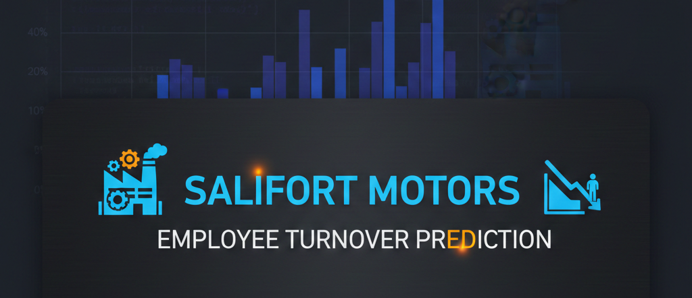

<p align="center">
  
</p>


# 🏭 Salifort Motors – Employee Turnover Prediction  
### HR Analytics • Machine Learning • Random Forest • Python  
---

<p align="center">
  
</p>

---

## 📌 Project Overview

Employee turnover is a major challenge for Salifort Motors, leading to increased recruitment costs, loss of productivity, and disruption across teams.  
This project uses **HR analytics and machine learning** to identify the key drivers of turnover and predict which employees are most likely to leave.

---

## 🎯 Objectives

- Analyze HR data to uncover patterns associated with employee departure  
- Build a high-performing predictive model (Random Forest)  
- Identify key features influencing turnover  
- Provide actionable recommendations to improve retention  
- Deliver insights through a clean, reproducible notebook and executive-ready reports  

---

## 📊 Key Findings

### 🔹 Primary Turnover Drivers
1. **Satisfaction level** — strongest predictor  
2. **Time spent at the company**  
3. **Number of projects**  
4. **Average monthly hours**  
5. **Last evaluation score**

### 🔹 Model Performance
- **Accuracy:** 99%  
- **Precision (left):** 98%  
- **Recall (left):** 96%  
- **F1-score:** 97%  
- **ROC-AUC:** 0.992  

The Random Forest model demonstrates **excellent predictive capability** and is suitable for real HR operational use.

---

## 📁 Project Structure

```bash
Salifort-Motors-Turnover-Analysis/
│
├── data/
│   └── HR_comma_sep.csv
│
├── notebooks/
│   └── salifort_turnover_analysis.ipynb
│
├── reports/
│   ├── Executive_Summary_Salifort_Motors.pdf
│   └── PACE_Strategy_Document_Salifort_Motors.pdf
│
├── models/
│   ├── random_forest_model.pkl
│   └── random_forest_model.joblib
│
├── images/
│   ├── feature_importance.png
│   ├── confusion_matrix.png
│   ├── roc_curve.png
│   └── satisfaction_plot.png
│
├── requirements.txt
└── README.md

---

## 🧠 Tech Stack

- **Python 3.10**  
- **Pandas, NumPy**  
- **Matplotlib, Seaborn**  
- **Scikit-learn (RandomForestClassifier)**  
- **Joblib / Pickle**  
- **Jupyter Notebook**

---

## 📝 Reports

- 📄 **Executive Summary** — Business-focused insights & recommendations  
- 📄 **PACE Strategy Document** — Planning, Analysis, Construction, Execution  
- 📓 **Jupyter Notebook** — Full EDA, modeling, and evaluation  

These documents are available in the **/reports** folder.

---

## 🧩 How to Run the Project

Follow the steps below to set up and run the project on your machine:

```bash
# 1️⃣ Clone this repository
git clone https://github.com/ahmedtarek-mel/Salifort-Motors-Turnover-Analysis.git

# 2️⃣ Navigate into the project folder
cd Salifort-Motors-Turnover-Analysis

# 3️⃣ Install all dependencies
pip install -r requirements.txt

# 4️⃣ Launch Jupyter Notebook
jupyter notebook


📬 Contact

Ahmed Tarek
Data Scientist & Machine Learning Engineer
🔗 GitHub: https://github.com/ahmedtarek-mel

🔗 LinkedIn: https://www.linkedin.com/in/ahmed-tarek-ai

📜 License

This project is released under the MIT License.
